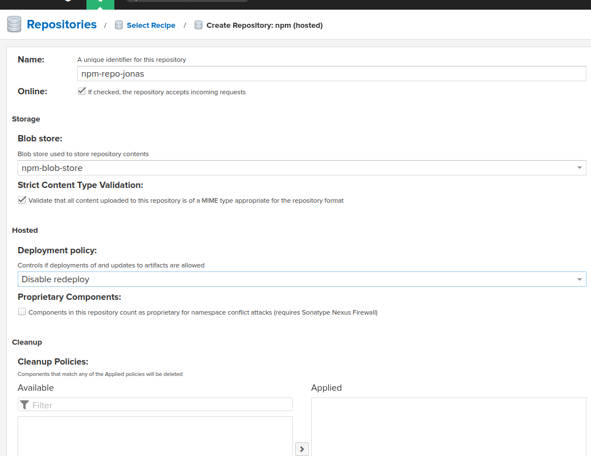
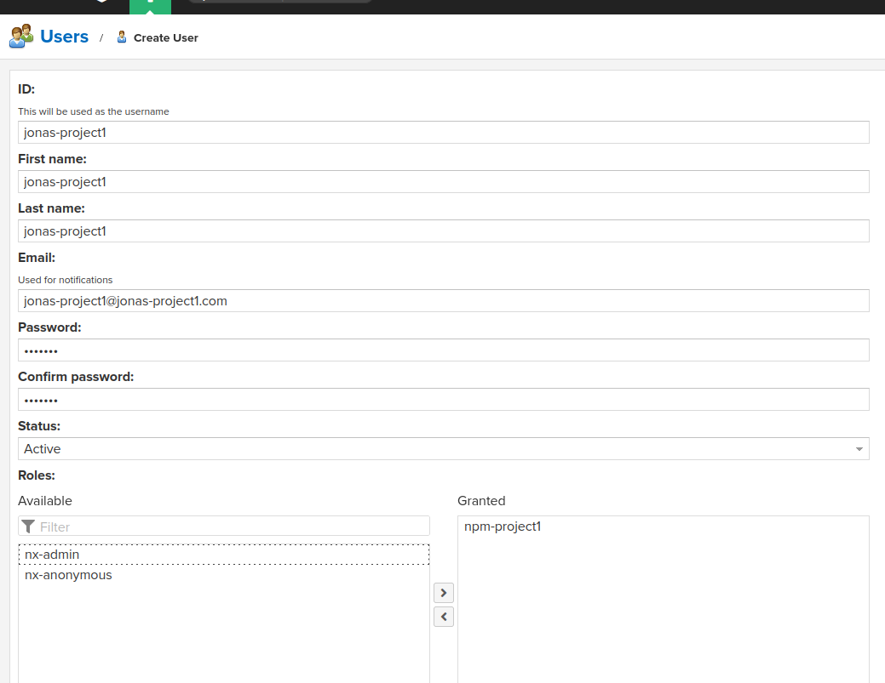
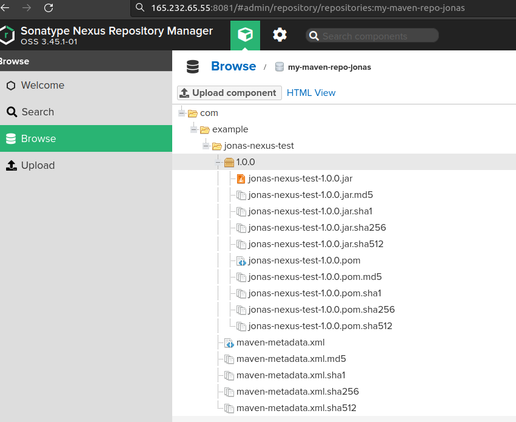

### Study notes for lecture 6

## Exercise 1
1. Created droplet via UI on digital ocean cloud
2. Installed Nexus via:
    ```
    #retrieve nexus from download url
    cd /opt
    wget https://download.sonatype.com/nexus/3/nexus-3.45.1-01-unix.tar.gz
    tar -zxfv nexus-3.45.1-01-unix.tar.gz
    
    #create user
    useradd nexus
    
    #give respective rights to nexus user on necessary folders
    sudo chown nexus:nexus nexus-3.45.1-01 -R
    sudo chown nexus:nexus sonatype-work -R

    #adjust nexus.rc file to run nexus as nexus user
    vi /opt/nexus-3.45.1-01/bin/nexus.rc

    #run nexus:
    /opt/nexus-3.45.1-01/bin/nexus start
    ```
3. On digital ocean cloud connect respective firewall to newly created droplet and added port 8081 to allow access to nexus repository manager

## Exercise 2
1. Created blob store for npm repo
2. Created npm repo via ui and link respective blob store


## Exercise 3
1. Created role with respective access to repo
2. Created user and link role to user


## Exercise 4
1. Install npm and nodejs
    ```
    apt -y install npm
    apt -y install nodejs
    ```
2. Login to nexus registry:
   ```
   npm login --registry=http://<droplet-IP>:8081/repository/npm-repo-jonas/
   ```
3. Needed to create a bearer token realm on nexus in the Settings under System->Realms
4. Publish npm project:
    in the package folder run:
    ```
    npm publish --registry=http://<droplet-IP>:8081/repository/npm-repo-jonas/
    ```
    

## Exercise 5 - 7
1. Analog to Exercise 2 create a maven repo
2. Analog to Exercise 4 create a role and user with access to this repo
3. Publish the the jar file via gradle
    - To do this adjust the build.gradle file and include maven-publish plugin, nexus registry and repo url and credentials via variables (read from )
    - inlcude a gradle.properties file to store the credentials (and exclude it via .gitignore file)
    - incldude gradle.settings file to store the app name
4. run the gradle publish command:
    ```
    gradlew publish
    ```


## Exercise 8
1. Analog previous exercises create user for new droplet
2. Give user access to both repos (via respective roles)
3. Run the following commands to retrieve the latest version of the NodeJS artifact
    ```
        downloadUrl=$(curl -u droplet-user:droplet-user -X GET "http://<droplet-IP>:8081/service/rest/v1/components?repository={my-maven-repo-jonas}&sort=version" | jq '.items[0].assets[0].downloadUrl' --raw-output)
        wget --http-user=droplet-user --http-password=droplet-user $downloadUrl
    ```

### Exercise 9
Given npm and nodejs have been installed on droplet:
See [automated script](exercise9.sh)
